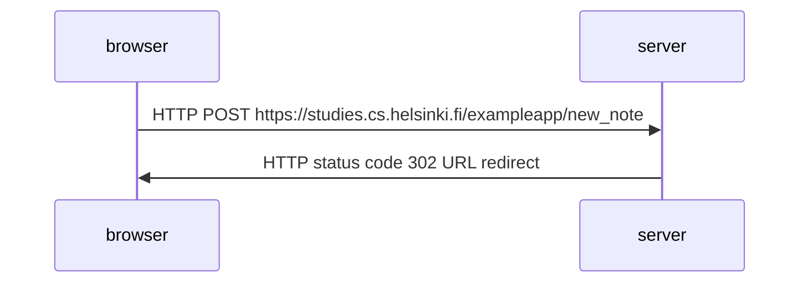
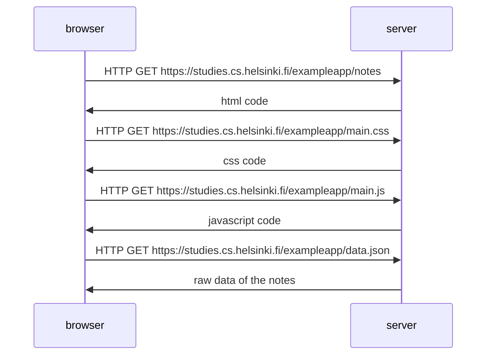

0.4 New note diagram

note over browser:
when the button on the form is clicked
browser will send the user input to the server
end note

note ofer browser:
browser requests updated html code
browser requests css code
browser requests javascript code
that requests JSON data from server 
end note
