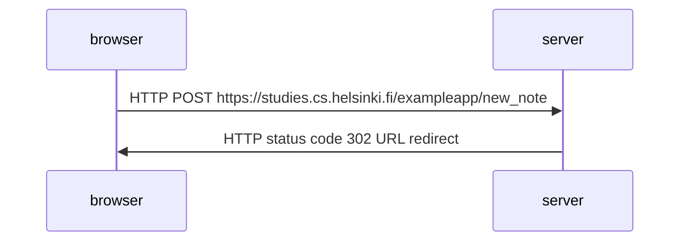
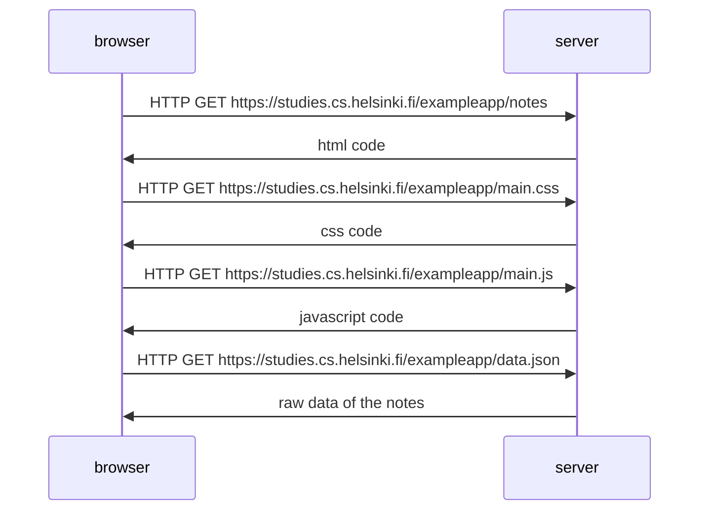
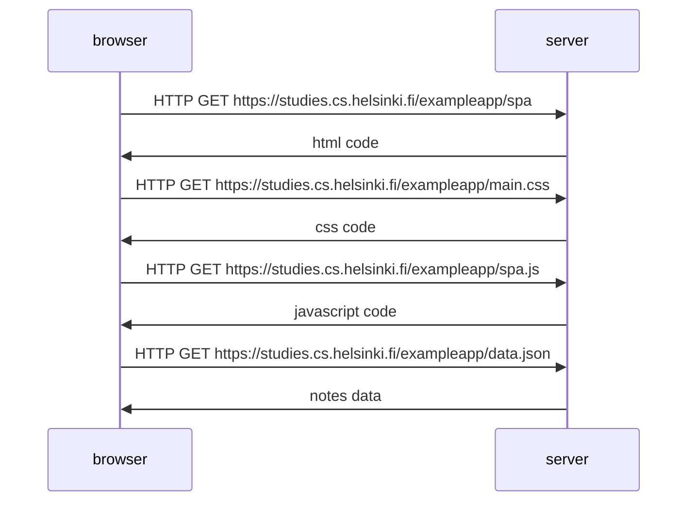
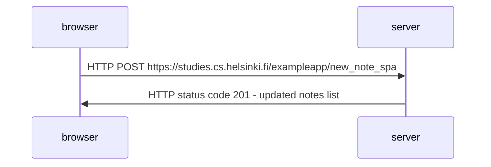

0.4 New note diagram
  

note over browser:  
when the button on the form is clicked  
browser will send the user input to the server  
end note  

note over browser: 
browser requests updated html code 
browser requests css code 
browser requests javascript code 
that requests JSON data from server  
end note 

0.5: Single page app diagram
  

0.6: New note in Single page app diagram
  

note over browser: 
browser sends the user input to the server 
browser fetches notes data from the server 
end note 